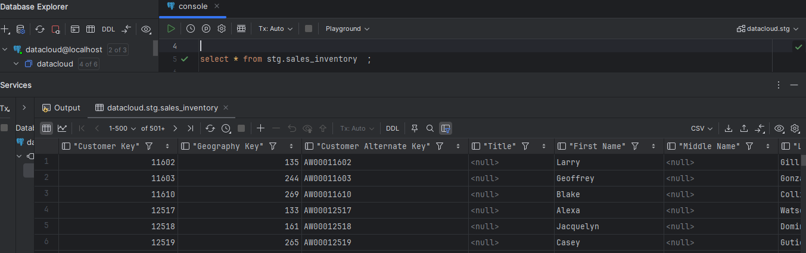
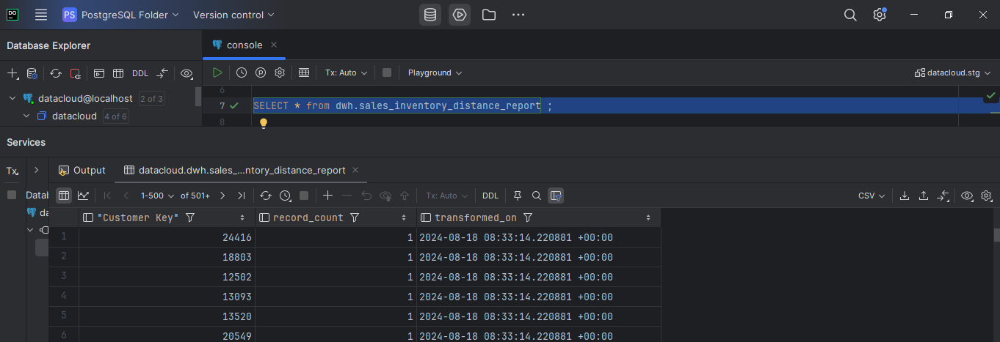

# dbt Framework Documentation

--- 

## Set Up Environment

```cmd
pip install virtualenvwrapper-win  
virtualenv dbt_env			
cd dbt_env/scripts			
activate				
cd..				
cd..	
```

---

### Installation

---

**Step 1: Install dbt**

```cmd
pip install dbt-core
```

**Step 2: Initialize dbt project**

```cmd
dbt init test_project
```

---


**Step 3: Install Adapters**

```cmd
pip install dbt-postgres
pip install dbt-snowflake
dbt --version
```

**Step 4: Configure `profile.yml`**

- Adding `Adapter` for **PostgreSQL**

```yml
test_project:
  target: dev
  outputs:
    dev:
      type: postgres
      host: localhost
      user: postgres
      password: IMRUL
      port: 5432
      dbname: datacloud
      schema: stg  # Source schema (default)
      search_path: stg, dwh  # Search path to include both source and target schemas
      threads: 4  # Number of parallel threads
```

> Note: file is located in `C:\Users\imrul.hasan\.dbt` folder (`~/.dbt/`)

**Step 5: Create new file in `macros`**

- Adding macros to modify existing schema naming behavior [`generate_schema_name.sql`]

```sql


    
    

        {{ default_schema }}

    

        {{ custom_schema_name | trim }}

    


```

**Step 7: Create .SQL file**

```sql
/*** 
    materialized='incremental',  -- 'view', 'table', 'incremental', 'ephemeral'
    unique_key='inventory_id',   -- Assuming 'inventory_id' is unique
    incremental_strategy='insert_overwrite', -- OptionS: merge, append, insert_overwrite
    partition_by={'field': 'last_update', 'data_type': 'timestamp'} -- Optional, for partitioned tables
***/

{{ config(
    materialized='incremental',
    unique_key='"Customer Key"',
)}}




    -- INCREAMENTAL REFRESH
    with max_customer_key as (
        select max("Customer Key") as max_key
        from {{ this }}
    )
    select 
        sd."Customer Key", 
        sd.record_count, 
        sd.transformed_on
    from
    (
        select
            "Customer Key", 
            count(1) as record_count, 
            {{ current_time }} as transformed_on
        from stg.sales_inventory as sd
        group by "Customer Key"
    ) sd
    where sd."Customer Key" > (select max_key from max_customer_key)

    -- FULL REFRESH
    select 
        "Customer Key", 
        count(1) as record_count, 
        {{ current_time }} as transformed_on
    from stg.sales_inventory 
    group by "Customer Key"

```





---

**Step 8: Debug**

```cmd
dbt debug
```

> make sure to `cd` to the Project Folder

**Step 9: Run DBT Project**

```cmd
dbt run
dbt run --threads 4
```

---

## **Core Concepts**

### Models

---

### Sources

---

### Seeds

---

### Snapshots

---

### Tests

---

### Jinja Macros

---

### Packages

---

## **Advanced Topics**

### Materializations

---

### Deployment and Scheduling

---

### DBT Cloud

---

### Optimizing DBT Models

---

## **Best Practices**

### Project Organization

---

### Version Control

---

### Testing and Debugging

---


